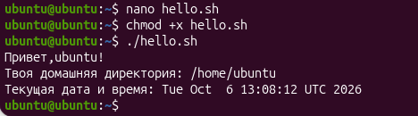

### Задача 1.
```
echo "Привет, $USER!"
echo "Твоя домашняя директория: $HOME"
echo "Текущая дата и время: $(date)"
```


### Задача 2.
```
echo "OK"
```
Объяснение: без ./ система ищет файл только в системных папках (переменная $PATH), а текущую директорию игнорирует ради безопасности check.sh.


### Задача 3.
```
echo "Используется гибкий shebang"
```

### Задача 4.
```
ls -l "$0"
```

### Задача 5.
```
echo "Имя скрипта: $0"
echo "Количество аргументов: $#"
echo "Все аргументы одной строкой: $@"
echo "Первый аргумент: $1"
echo "Последний аргумент: ${@: -1}"
```

### Задача 6.
NAME="Кирилл"
CITY="Санкт-Петербурга"
AGE=17
echo "${NAME}, ${AGE} лет, из ${CITY}"
```

### Задача 7.
```
echo "Имя скрипта: $0"
echo "PID скрипта: $$"
true
echo "Код возврата последней команды: $?"
```

### Задача 8.
```
read -p "Введите первое число: " num1
read -p "Введите второе число: " num2
echo "Сумма: $((num1 + num2))"
echo "Разность: $((num1 - num2))"
echo "Произведение: $((num1 * num2))"
echo "Частное: $((num1 / num2))"
echo "Остаток: $((num1 % num2))"
```

### Задача 9. 
```

```

### Задача 10.
```

```

### Задача 11.
```
name=${1:-Гость}
echo "Привет, $name!"
```

### Задача 12.
```

```

### Задача 13.
```

```

### Задача 14.
```
echo "Значение CONFIG: ${CONFIG:?Переменная CONFIG не задана! Скрипт остановлен.}"
```

### Задача 15.
```

```

### Задача 16.
```
read -p "Введите строку: " user_str
echo "Верхний регистр: ${user_str^^}"
echo "Нижний регистр: ${user_str,,}"
echo "Длина строки: ${#user_str} симв."
```

### Задача 17. 
```

```

### Задача 18.
```

```

### Задача 19.
```

```

### Задача 20.
```

```
